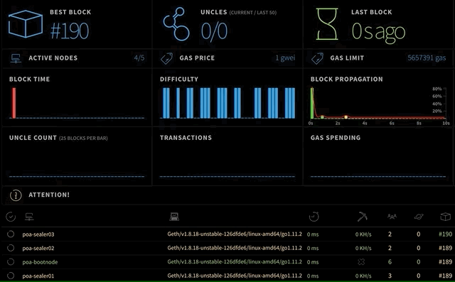

# Puppeth를 이용해 AWS에 Private Ethereum Network 구성하기 (PoA)

---

geth(go-ethereum)을 이용해서 프라이빗 이더리움 네트워크를 구축하는 방법은 크게 두 가지가 있다.
* 직접 각각의 서버에 geth를 설치하고 bootnode, sealernode 설정들을 다 해주는 것이다.
* geth에 포함되어 있는 puppeth라는 툴을 이용해서 미리 설정 된 docker 설정을 통해서 서버에 docker를 올리기만 하면 되는 것이다.

첫 번째 방법은 1대의 서버(또는 개인PC)를 이용해서 여러 노드를 띄워서 구성해 볼 수 있지만, 두 번째 방법은 리모트 서버에 배포하는 방식으로만 구성할 수 있다. (혹시나 로컬에서 할 수 있는 방법을 알고 계시면 알려주세요.)

로컬에 매뉴얼하게 구성하는 방식은 귀찮긴 하지만 많이 어려운 부분이 없어서, 이번에는 puppeth를 이용해서 AWS EC2 인스턴스에 프라이빗 네트워크 구성에 필요한 요소들을 배포하는 방법을 알아보도록 한다.

---

## 사전 준비
* AWS 유료 계정
* AWS 접속을 위한 .pem 키 파일 (여기에서는 `~/.ssh/`에 저장되어 있는 `aws_key.pem`라고 가정한다.)
* 해당 .pem 파일의 권한은 `400`이어야 한다. 아닐 경우 `chmod 400 aws_key.pem`으로 설정한다.
* 기본적으로 AWS EC2 인스턴스를 만들 수 있는 능력
* Ubuntu 기본 사용 지식

---

## AWS 인스턴스 만들기

### 보안그룹 생성


### 인스턴스 생성
총 4개의 인스턴스를 이용해서 프라이빗 네트워크를 구성하며, 모두 동일한 보안그룹으로 설정한다.
* t2.micro, Ubuntu 18.04 (1개) - Puppeth를 설치해서 원격으로 배포할 Controller node
* t2.medium, Ubuntu 18.04 (3개가 필요한데 우선은 1개만 만들겠다) - Sealer, Ethstats, Bootnode 등의 Docker가 배포 될 Worker node

생성한 인스턴스에 이름을 지정하고, Public IP를 기록해 놓는다.

> * poa-controller : [ip of controller]
> * poa-worker01 : [ip of worker01]

## 인스턴스 별 설정

### Worker node 필요 패키지 설치
* poa-worker01 인스턴스 접속
```
$ ssh -i ~/.ssh/aws_key.pem ubuntu@[ip of poa-worker01]
```

* 최신 패키지 목록 받아오기
```
$ sudo apt-get update
$ sudo apt-get upgrade
```
* Docker 관련 패키지 설치
```
$ sudo apt-get install \
    apt-transport-https \
    ca-certificates \
    curl \
    software-properties-common
```
* Docker 공식 GPG 추가 및 검증
```
$ curl -fsSL https://download.docker.com/linux/ubuntu/gpg | sudo apt-key add -
$ sudo apt-key fingerprint 0EBFCD88
pub   4096R/0EBFCD88 2017-02-22
      Key fingerprint = 9DC8 5822 9FC7 DD38 854A  E2D8 8D81 803C 0EBF CD88
uid                  Docker Release (CE deb) <docker@docker.com>
sub   4096R/F273FCD8 2017-02-22
```

* Docker repository 추가
```
$ sudo add-apt-repository \
   "deb [arch=amd64] https://download.docker.com/linux/ubuntu \
   $(lsb_release -cs) \
   stable"
$ sudo apt-get update
```

* Docker CE, Compose 설치
```
$ sudo apt-get install docker-ce docker-compose
```

* Docker 그룹 추가 및 현재 사용자 docker 그룹에 추가
```
$ sudo groupadd Docker
$ sudo usermod -aG docker $USER
```

* 접속 해제 후 다시 접속하여 docker 명령어 실행
```
$ exit
$ ssh -i ~/.ssh/aws_key.pem ubuntu@[ip of poa-worker01]
$ docker ps
```
권한 관련 에러 메세지 없이 정상적으로 실행되면 worker node 준비 완료

### Controller node 필요 패키지 설치

* poa-controller 인스턴스 접속
```
$ ssh -i ~/.ssh/aws_key.pem ubuntu@[ip of poa-controller]
```

* 필요 패키지 설치
```
$ sudo apt-get update
$ sudo apt-get upgrade
$ sudo apt-get instal build-essential bison
```

* gvm(Go Version Manager) 설치
```
$ bash < <(curl -s -S -L https://raw.githubusercontent.com/moovweb/gvm/master/binscripts/gvm-installer)
$ source ~/.gvm/scripts/gvm
```

* Go 설치
```
$ gvm install go1.4 --binary
$ gvm use go1.4
$ export GOROOT_BOOTSTRAP=$GOROOT
$ gvm install go1.10.1
$ gvm use go1.10.1
```

* Geth 클론, 빌드 및 puppeth 실행 확인
```
$ git clone https://github.com/ethereum/go-ethereum.git
$ cd go-ethereum
$ make all
$ cd build/bin
$ ./puppeth
```

puppeth가 정상적으로 실행된다면 `ctrl + C` 를 눌러서 빠져나온다.

### Worker nodes에 Controller node의 SSH 인증 키 등록하기
0. .pem 파일이 저장되어 있는 로컬PC로 이동
1. poa-controller에 .pem 파일 복사하기
`scp -i ~/.ssh/aws_key.pem ~/.ssh/aws_key.pem ubuntu@[ip of controller]:~/.ssh/`
2. poa-controller 인스턴스에 접속하기
`ssh -i ~/.ssh/aws_key.pem ubuntu@[ip of controller]`
3. `aws_key.pem` 파일 권한 설정하기
`chmod 400 ~/.ssh/aws_key.pem`
4. poa-controller의 SSH 인증키 생성

```
$ ssh-keygen -t rsa
Generating public/private rsa key pair.
Enter file in which to save the key (/Users/user_name/.ssh/id_rsa):
/Users/user_name/.ssh/id_rsa already exists. #이미 존재할 경우 새로 만들지 않아도 된다.
Overwrite (y/n)? y
Enter passphrase (empty for no passphrase): #공백
Enter same passphrase again: #공백
Your identification has been saved in /Users/user_name/.ssh/id_rsa.
Your public key has been saved in /Users/user_name/.ssh/id_rsa.pub.
```
5. poa-controller의 SSH public 인증키 복사
`cat ~/.ssh/id_rsa.pub`
> ssh-rsa AAAAB3Nza...BT7f4D user_name

6. 위의 내용을 복사한 후 poa-worker01의 authroized_keys 파일에 추가한다.

```
$ ssh -i ~/.ssh/aws_key.pem ubuntu@[ip of poa-worker01]
$ vi ~/.ssh/authroized_keys
```
7. 정상적으로 설정이 되었는지 확인한다. `ssh ubuntu@[ip of poa-worker01]`

### Worker 인스턴스 복제
* 패키지 설치 및 SSH 설정이 완료 된 poa-worker01 인스턴스를 AMI 이미지로 만들어서 인스턴스 poa-worker02, poa-worker03를 만든다.

## 지갑 생성
각 worker가 block 블록 생성 시 sealing하기 위한 계정과 미리 ether를 할당하기 위해 필요한 계정을 미리 생성한다.

### 패스워드 파일 생성
* poa-controller 인스턴스 접속
* `passfile`이란 파일에 패스워드 저장
```
$ cd ~
$ vim passfile #파일에 패스워드를 저장한다.
$ sudo perl -pi -e 'chomp if eof' passfile #혹시 모를 공백을 제거한다.
$ chmod 700 passfile
```

### 계정 생성
```
$ ./go-ethereum/build/bin/geth account new --password passfile
```
실행 시 나오는 계정 주소를 메모장에 저장한다. 해당 계정을 sealer01로 사용할 예정이다.
같은 과정을 10번 더 실행한다. 동일하게 10번 더 입력해도 되고, 아래 코드를 돌려도 된다.

```
$ for ((n=0;n<10;n++)); do ./go-ethereum/build/bin/geth account new --password ~/passfile; done
```

아래처럼 생성 된 계정 주소를 저장해 놓는다.
> ### Node Account
> * Sealer01 :
db9fbae4a5c375f163ce14dca3482c21c0cdc120
> * Sealer02 :
25447734114e902a3b415f9d30fc1b91f84f92f9
> * Sealer03 :
37adbea7f6b912a00cc7c997da886150137fa0a1
> * Faucet
 : 247a16f7eeeae3f08a7feff3f16b558ac7db4833
>
> ### Other Account
> * e29eefd6169cf0ed24a3b3e54786bd0dbc536f0e
> * 789f688a0bf29702e60996c128078a07698299c7
> * ac97e6c385b31567c1ef053f85ec47c8a6776cd5
> * a4ad80085b9eae565a9d1672e6c8eebc08947417
> * 7a667c58941b217c929fc9707cdfa6bb936dd477
> * ec47dc3e80675ab0eec335b40d12384cba0af654
> * 02425462955e41568acca599c3a92eb13f266944


## Puppeth로 Network 정의하기
* poa-controller 인스턴스에서 puppeth 실행하기

```
$ ./go-ethereum/build/bin/puppeth
```

* puppeth 실행 화면

```
+-----------------------------------------------------------+
| Welcome to puppeth, your Ethereum private network manager |
|                                                           |
| This tool lets you create a new Ethereum network down to  |
| the genesis block, bootnodes, miners and ethstats servers |
| without the hassle that it would normally entail.         |
|                                                           |
| Puppeth uses SSH to dial in to remote servers, and builds |
| its network components out of Docker containers using the |
| docker-compose toolset.                                   |
+-----------------------------------------------------------+

# 원하는 네트워크 이름을 지정한다. 공백, 하이픈 없이 입력
Please specify a network name to administer (no spaces or hyphens, please)
> poa
```

### Genesis block 설정

```
# 다음 실행 시에는 puppeth --network=네트워크 이름을 입력하면 바로 해당 네트워크 설정이 가능
Sweet, you can set this via --network=poa next time!

INFO [11-06|05:08:16.951] Administering Ethereum network           name=poa
WARN [11-06|05:08:16.951] No previous configurations found         path=/home/ubuntu/.puppeth/poa

# 어떤 작업을 할 것인지 선택 : 2번 새로운 제네시스 파일 설정으로 들어간다.
What would you like to do? (default = stats)
 1. Show network stats
 2. Configure new genesis
 3. Track new remote server
 4. Deploy network components
> 2

# 합의 알고리즘 선택 : 2번 PoA
Which consensus engine to use? (default = clique)
 1. Ethash - proof-of-work
 2. Clique - proof-of-authority
> 2

# 블록 생성 주기 : 5초 (원하는 주기로 설정. 기본 15초)
How many seconds should blocks take? (default = 15)
> 5

# 블록 생성(Sealing)을 할 계정을 지정한다. 아까 적어 놓은 Sealer01~03 주소 입력 그리고 엔터
Which accounts are allowed to seal? (mandatory at least one)
> 0xdb9fbae4a5c375f163ce14dca3482c21c0cdc120
> 0x25447734114e902a3b415f9d30fc1b91f84f92f9
> 0x37adbea7f6b912a00cc7c997da886150137fa0a1
> 0x

# 처음 생성 시 프라이빗 네트워크 상의 ether를 할당 할 계정을 지정한다.
# 사용자 목적에 따라서 다르게 지정할 수 있다.
# 여기서는 Sealer, Faucet, 그리고 나머지 3개의 계정을 추가한다.
# 그리고 엔터
Which accounts should be pre-funded? (advisable at least one)
> 0xdb9fbae4a5c375f163ce14dca3482c21c0cdc120
> 0x25447734114e902a3b415f9d30fc1b91f84f92f9
> 0x37adbea7f6b912a00cc7c997da886150137fa0a1
> 0x247a16f7eeeae3f08a7feff3f16b558ac7db4833
> 0xe29eefd6169cf0ed24a3b3e54786bd0dbc536f0e
> 0x789f688a0bf29702e60996c128078a07698299c7
> 0xac97e6c385b31567c1ef053f85ec47c8a6776cd5
> 0x

# 네트워크 식별을 위한 숫자 입력 (원하는 숫자 입력 또는 기본 랜덤값 사용)
Specify your chain/network ID if you want an explicit one (default = random)
>
INFO [11-06|05:20:12.350] Configured new genesis block
# Genesis block 설정이 만들어졌다.
```

### Genesis 파일 만들기
* puppeth 2번 메뉴가 `Configure new genesis`에서 `Manage existing genesis`으로 바뀐 것을 확인할 수 있다.

```
What would you like to do? (default = stats)
 1. Show network stats
 2. Manage existing genesis
 3. Track new remote server
 4. Deploy network components
> 2

# 아까 설정한 제네시스 블록 설정을 파일로 익스포트 시킨다.
 1. Modify existing fork rules
 2. Export genesis configuration
 3. Remove genesis configuration
> 2

# 파일명은 무난하게 genesis.json (기본 값은 네트워크 이름.json)
 Which file to save the genesis into? (default = poa.json)
 > genesis.json

# 제네시스 파일 생성이 끝났으니, control + c를 눌러서 빠져나온다.
What would you like to do? (default = stats)
  1. Show network stats
  2. Manage existing genesis
  3. Track new remote server
  4. Deploy network components
 > ^C
```
* puppeth 명령을 실행한 경로를 확인하면 `genesis.json` 파일이 생성 된 것을 확인할 수 있다.

## Keystore 정보 가져오기
* Sealer, Faucet 배포 시에 사용 할 Keystore 정보를 가져와서 계정 정보를 저장해 놓은 곳에 추가한다.
* 저장 된 곳으로 이동

```
$ cd ~/.ethereum/Keystore
$ ls

UTC--2018-11-01T05-44-20.757934202Z--db9fbae4a5c375f163ce14dca3482c21c0cdc120
UTC--2018-11-01T05-46-45.158789104Z--25447734114e902a3b415f9d30fc1b91f84f92f9
UTC--2018-11-01T05-46-58.260177019Z--37adbea7f6b912a00cc7c997da886150137fa0a1
UTC--2018-11-01T05-47-11.989208267Z--247a16f7eeeae3f08a7feff3f16b558ac7db4833
```

* `생성 일시 - 계정 주소` 형태의 파일을 확인할 수 있다.
* Sealer01 ~ 03, Faucet용으로 할당해 놓았던 계정의 keystore 파일이 있는지 확인한다.
* JSON 형태의 파일 내용을 확인하고 저장한다.

```
$ cat UTC--2018-11-01T05-44-20.757934202Z--db9fbae4a5c375f163ce14dca3482c21c0cdc120

{"address":"db9fbae4a5c375f163ce14dca3482c21c0cdc120", ... ,"version":3}
```

## 배포하기

* 우선 poa-worker01 인스턴스에 ethstats, bootnode와 sealer를 배포해 보자.
* 배포 과정을 설정을 하면 해당 설정을 바탕으로 리모트에 있는 서버에 geth node가 설치 된 docker container를 배포하는 형태이다.
* 기본적으로 사용되는 geth 버전은 lastest로 지정되어 있어서, 변경을 원할 경우 poa-controller에 있는 geth 소스를 수정한 후 새로 빌드한 후 실행해야 한다.

* puppeth를 다시 실행한다.

```
./go-ethereum/build/bin/puppeth --network poa
```

### poa-worker01에 ethstats 배포

```
# 4번 네트워크 컴포넌트 배포 선택
What would you like to do? (default = stats)
 1. Show network stats
 2. Manage existing genesis
 3. Track new remote server
 4. Deploy network components
> 4

# 1번 ethstats (네트워크 모니터링 툴) 선택
What would you like to deploy? (recommended order)
 1. Ethstats  - Network monitoring tool
 2. Bootnode  - Entry point of the network
 3. Sealer    - Full node minting new blocks
 4. Explorer  - Chain analysis webservice (ethash only)
 5. Wallet    - Browser wallet for quick sends
 6. Faucet    - Crypto faucet to give away funds
 7. Dashboard - Website listing above web-services
> 1

# 어디에 배포할 것인지 선택 (아직 연결 된 서버가 없어서 목록이 없음)
# 1번 선택
Which server do you want to interact with?
 1. Connect another server
> 1

# 리모트 서버 IP 주소 입력 (poa-worker01). local에 배포 불가
What is the remote server's address ([username[:identity]@]hostname[:port])?
> [ip of poa-worker01]

# 접속 허용할 지 물음
The authenticity of host '[ip of poa-worker01]:22 ([ip of poa-worker01]:22)' can't be established.
SSH key fingerprint is ba:...5e [MD5]
Are you sure you want to continue connecting (yes/no)? yes

# 어떤 포트를 통해서 서비스를 할 것인지 선택 (본인이 원하는 포트 선택. 기본은 80)
Which port should ethstats listen on? (default = 80)
> 8080

# 다른 서비스와 포트를 공유할 것인지? (기본은 예)
Allow sharing the port with other services (y/n)? (default = yes)
> n

# sealer 노드 실행 시 ethstats와 연결하기 위해 공유하는 API 패스워드
What should be the secret password for the API? (must not be empty)
> ApiSecret

# docker 배포 실행 중
Creating network "poa_default" with the default driver
Building ethstats
Step 1/2 : FROM puppeth/ethstats:latest
latest: Pulling from puppeth/ethstats
Digest: sha256:1728c03555d3327f68be924116eed9f9de56671949c21505f4b78518f06e687e
Status: Downloaded newer image for puppeth/ethstats:latest
 ---> fb62abe59cb2
Step 2/2 : RUN echo 'module.exports = {trusted: ["[ip of poa-worker01]]"], banned: [], reserved: ["yournode"]};' > lib/utils/config.js
 ---> Running in 3902fab14976
Removing intermediate container 3902fab14976
 ---> 5a8cd4b19e41
Successfully built 5a8cd4b19e41
Successfully tagged poa/ethstats:latest
Creating poa_ethstats_1 ...
Creating poa_ethstats_1 ... done
INFO [11-06|06:15:19.402] Starting remote server health-check      server=[ip of poa-worker01]
WARN [11-06|06:15:19.717] Ethstats service seems unreachable       server=[ip of poa-worker01] port=8080 err="dial tcp [ip of poa-worker01]:8080: connect: connection refused"
+--------------+--------------+----------+-----------------------+--------------+
|    SERVER    |   ADDRESS    | SERVICE  |        CONFIG         |    VALUE     |
+--------------+--------------+----------+-----------------------+--------------+
| [ip address] | [ip address] | ethstats | Banned addresses      |              |
|              |              |          | Login secret          | ApiSecret    |
|              |              |          | Website address       | [ip address] |
|              |              |          | Website listener port | 8080         |
+--------------+--------------+----------+-----------------------+--------------+
```

* 브라우저에 poa-worker01의 Public IP:8080을 입력하여 아래와 같은 화면이 나온다면 ethstats가 정상 배포 된 것이다.
* 아직 블록을 만들고 있지 않기 때문에 아무 것도 안 나오는 것이 정상이다.


### poa-worker01에 bootnode 배포

```
# ethstats 배포를 해서 메뉴가 Deploy network components 에서 Manage network components 로 변경되었다.
# 4번 선택
What would you like to do? (default = stats)
 1. Show network stats
 2. Manage existing genesis
 3. Manage tracked machines
 4. Manage network components
> 4       

# 새로운 컴포넌트 배포를 위해 2번 선택
 1. Tear down Ethstats on [ip of poa-worker01]
 2. Deploy new network component
> 2

# 2번 부트노드 (네트워크 엔트리 포인트 - 네트워크 상에 존재하는 노드 정보를 관리) 선택
What would you like to deploy? (recommended order)
 1. Ethstats  - Network monitoring tool
 2. Bootnode  - Entry point of the network
 3. Sealer    - Full node minting new blocks
 4. Explorer  - Chain analysis webservice (ethash only)
 5. Wallet    - Browser wallet for quick sends
 6. Faucet    - Crypto faucet to give away funds
 7. Dashboard - Website listing above web-services
> 2

# ethstats를 배포했던 서버가 목록에 추가되어 있음
# 1번 추가
Which server do you want to interact with?
 1. [ip of poa-worker01]
 2. Connect another server
> 1

# geth 데이터(블록 데이터 및 기타)를 어디에 저장할 것인지 지정
Where should data be stored on the remote machine?
> /home/ubuntu/bootnode/

# 통신에 사용할 포트 지정 (기본 30303)
Which TCP/UDP port to listen on? (default = 30303)
> 30305

# 얼마나 많은 피어 접속을 허용할 것인가 (기본값 512)
How many peers to allow connecting? (default = 512)
>

# 얼마나 많은 라이트 피어 접속을 허용할 것인가 (기본값 256)
How many light peers to allow connecting? (default = 256)
>

# ethstats 상에서 노드를 어떤 이름으로 보여줄 것인지 설정
What should the node be called on the stats page?
> poa-bootnode

Building bootnode
Step 1/4 : FROM ethereum/client-go:latest
 ---> 214e8b03f1ec
Step 2/4 : ADD genesis.json /genesis.json
 ---> bbda7993c6fa
Step 3/4 : RUN   echo 'geth --cache 512 init /genesis.json' > geth.sh && 	echo $'exec geth --networkid 10929 --cache 512 --port 30305 --maxpeers 512 --lightpeers=256 --lightserv=50 --ethstats \'poa-bootnode:ApiSecret@[ip of poa-worker01]:8080\'    --miner.gastarget 0 --miner.gaslimit 0 --miner.gasprice 0' >> geth.sh
 ---> Running in f71d651f912d
Removing intermediate container f71d651f912d
 ---> 25fc0e3f8aab
Step 4/4 : ENTRYPOINT ["/bin/sh", "geth.sh"]
 ---> Running in ae26a8d64f33
Removing intermediate container ae26a8d64f33
 ---> 4a69df6803ed
Successfully built 4a69df6803ed
Successfully tagged poa/bootnode:latest
Creating poa_bootnode_1 ...
Creating poa_bootnode_1 ... done
INFO [11-06|06:49:02.481] Waiting for node to finish booting
INFO [11-06|06:49:05.481] Starting remote server health-check      server=[ip address]
+--------------+--------------+----------+--------------------------+-----------------------+
|    SERVER    |   ADDRESS    | SERVICE  |          CONFIG          |         VALUE         |
+--------------+--------------+----------+--------------------------+-----------------------+
| [ip address] | [ip address] | bootnode | Data directory           | /home/ubuntu/bootnode |
|              |              |          | Ethstats username        | poa-bootnode          |
|              |              |          | Listener port            | 30305                 |
|              |              |          | Peer count (all total)   | 512                   |
|              |              |          | Peer count (light nodes) | 256                   |
|              |              |          | ------------------------ | --------------------- |
|              |              | ethstats | Banned addresses         |                       |
|              |              |          | Login secret             | ApiSecret             |
|              |              |          | Website address          | [ip address]          |
|              |              |          | Website listener port    | 8080                  |
+--------------+--------------+----------+--------------------------+-----------------------+
```

* ethstats에서 bootnode가 추가 된 것을 확인할 수 있다.


### poa-worker01에 sealer 배포

```
# 네트워크 컴포넌트 관리를 위해 4번 선택
What would you like to do? (default = stats)
 1. Show network stats
 2. Manage existing genesis
 3. Manage tracked machines
 4. Manage network components
> 4

# 새로운 컴포넌트 배포를 위해 3번 선택
 1. Tear down Ethstats on [ip of poa-worker01]
 2. Tear down Bootnode on [ip of poa-worker01]
 3. Deploy new network component
> 3

# 3번 Sealer (새로운 블록을 생성하는 풀노드) 선택
What would you like to deploy? (recommended order)
 1. Ethstats  - Network monitoring tool
 2. Bootnode  - Entry point of the network
 3. Sealer    - Full node minting new blocks
 4. Explorer  - Chain analysis webservice (ethash only)
 5. Wallet    - Browser wallet for quick sends
 6. Faucet    - Crypto faucet to give away funds
 7. Dashboard - Website listing above web-services
> 3

# poa-worker01 선택
Which server do you want to interact with?
 1. [ip of poa-worker01]
 2. Connect another server
> 1

# sealer 데이터 저장 위치 지정
Where should data be stored on the remote machine?
> /home/ubuntu/sealer

# 통신에 사용할 포트 지정 (기본 값 30303)
Which TCP/UDP port to listen on? (default = 30303)
>

# 접속 허용할 피어 수 (기본 값 50)
How many peers to allow connecting? (default = 50)
>

# 접속 허용할 라이트 피어 수 (기본 값 0)
How many light peers to allow connecting? (default = 0)
>

# ethstats에서 보여질 이름 지정
What should the node be called on the stats page?
> poa-sealer01

# keystore 파일에 저장되어 있던 sealer01의 key 정보 JSON 복사 붙여넣기
Please paste the signer's key JSON:
> {"address":"db9fbae4a5c375f163ce14dca3482c21c0cdc120",...,"version":3}

# 계정 생성할 때 passfile에 입력한 패스워드
What's the unlock password for the account? (won't be echoed)
>

# 어떤 설정인지 확인 필요. 우선 기본 값 설정
What gas limit should empty blocks target (MGas)? (default = 7.500)
>

# 블록에 담을 수 있는 최대 가스 한도 설정 (기본 값 : 10MGas)
What gas limit should full blocks target (MGas)? (default = 10.000)
>

# 가스 비 설정
What gas price should the signer require (GWei)? (default = 1.000)
>
Building sealnode
Step 1/6 : FROM ethereum/client-go:latest
 ---> 214e8b03f1ec
Step 2/6 : ADD genesis.json /genesis.json
 ---> Using cache
 ---> bbda7993c6fa
Step 3/6 : ADD signer.json /signer.json
 ---> e9c80d7fee2e
Step 4/6 : ADD signer.pass /signer.pass
 ---> 727d7303931a
Step 5/6 : RUN   echo 'geth --cache 512 init /genesis.json' > geth.sh && 	echo 'mkdir -p /root/.ethereum/keystore/ && cp /signer.json /root/.ethereum/keystore/' >> geth.sh && 	echo $'exec geth --networkid 10929 --cache 512 --port 30303 --maxpeers 50  --ethstats \'poa-sealer01:ApiSecret@[ip of poa-worker01]:8080\' --bootnodes "enode://71485ad544d46dea4b27538b75d6c5888da25dc559f934d5da17ac6700dfcb42b0ca733b10a95b0306c3a1d73539af8b357796b7d22d5907c47733b2c7f1cabf@[ip of poa-worker01]:30305?discport=1024"  --unlock 0 --password /signer.pass --mine --miner.gastarget 7500000 --miner.gaslimit 10000000 --miner.gasprice 1000000000' >> geth.sh
 ---> Running in 0833fbcd4b89
Removing intermediate container 0833fbcd4b89
 ---> 70ab8d49002a
Step 6/6 : ENTRYPOINT ["/bin/sh", "geth.sh"]
 ---> Running in ad8bb418714d
Removing intermediate container ad8bb418714d
 ---> 2083282eabb5
Successfully built 2083282eabb5
Successfully tagged poa/sealnode:latest
Creating poa_sealnode_1 ...
Creating poa_sealnode_1 ... done
INFO [11-06|07:45:50.652] Waiting for node to finish booting
INFO [11-06|07:45:53.652] Starting remote server health-check      server=[ip of poa-worker01]
+--------------+--------------+----------+------------------------------+--------------------------------------------+
|    SERVER    |   ADDRESS    | SERVICE  |            CONFIG            |                   VALUE                    |
+--------------+--------------+----------+------------------------------+--------------------------------------------+
| [ip address] | [ip address] | bootnode | Data directory               | /home/ubuntu/bootnode                      |
|              |              |          | Ethstats username            | poa-bootnode                               |
|              |              |          | Listener port                | 30305                                      |
|              |              |          | Peer count (all total)       | 512                                        |
|              |              |          | Peer count (light nodes)     | 256                                        |
|              |              |          | ---------------------------- | ------------------------------------------ |
|              |              | ethstats | Banned addresses             |                                            |
|              |              |          | Login secret                 | ApiSecret                                  |
|              |              |          | Website address              | [ip address]                               |
|              |              |          | Website listener port        | 8080                                       |
|              |              |          | ---------------------------- | ------------------------------------------ |
|              |              | sealnode | Data directory               | /home/ubuntu/sealer                        |
|              |              |          | Ethstats username            | poa-sealer01                               |
|              |              |          | Gas ceil  (target maximum)   | 10.000 MGas                                |
|              |              |          | Gas floor (baseline target)  | 7.500 MGas                                 |
|              |              |          | Gas price (minimum accepted) | 1.000 GWei                                 |
|              |              |          | Listener port                | 30303                                      |
|              |              |          | Peer count (all total)       | 50                                         |
|              |              |          | Peer count (light nodes)     | 0                                          |
|              |              |          | Signer account               | 0xdb9fbaE4a5c375F163cE14Dca3482c21c0cdC120 |
+--------------+--------------+----------+------------------------------+--------------------------------------------+
```

* ethstats에서 poa-sealer01이 추가 된 것을 확인한다.


### poa-worker02, poa-worker03에 sealer 배포
* 아래 과정을 poa-worker02, poa-worker03 두 번 각각 진행해야 된다.

```
# 4번 선택
What would you like to do? (default = stats)
 1. Show network stats
 2. Manage existing genesis
 3. Manage tracked machines
 4. Manage network components
> 4

# 새로운 컴포넌트 배포
 1. Tear down Ethstats on [ip of poa-worker01]
 2. Tear down Bootnode on [ip of poa-worker01]
 3. Tear down Sealnode on [ip of poa-worker01]
 4. Tear down Sealnode on [ip of poa-worker02]
 5. Deploy new network component
> 5

# Sealer 선택
What would you like to deploy? (recommended order)
 1. Ethstats  - Network monitoring tool
 2. Bootnode  - Entry point of the network
 3. Sealer    - Full node minting new blocks
 4. Explorer  - Chain analysis webservice (ethash only)
 5. Wallet    - Browser wallet for quick sends
 6. Faucet    - Crypto faucet to give away funds
 7. Dashboard - Website listing above web-services
> 3

# 3번을 선택해서 새로운 서버에 배포
Which server do you want to interact with?
 1. [ip of poa-worker01]
 2. [ip of poa-worker02]
 3. Connect another server
> 3

# 새로운 서버 (poa-worker02, poa-worker03)의 IP 주소 입력
What is the remote server's address ([username[:identity]@]hostname[:port])?
> [ip of poa-worker02 or 03]

The authenticity of host '[ip of poa-worker02 or 03]:22 ([ip of poa-worker02 or 03]:22)' can't be established.
SSH key fingerprint is 03:...:a4 [MD5]
Are you sure you want to continue connecting (yes/no)? yes

# 블록 데이터 저장 경로
Where should data be stored on the remote machine?
> /home/ubuntu/sealer

# 기본 값 사용
Which TCP/UDP port to listen on? (default = 30303)
>

# 기본 값 사용
How many peers to allow connecting? (default = 50)
>

# 기본 값 사용
How many light peers to allow connecting? (default = 0)
>

# 이름 지정
What should the node be called on the stats page?
> poa-sealer02 or 03

# sealer02, sealer03 용으로 지정해 놓았던 keystore 정보 입력
Please paste the signer's key JSON:
> {"address":"37adbea7f6b912a00cc7c997da886150137fa0a1",...,"id":"f0752279-bc7c-4f23-b25f-8565851b29eb","version":3}

# passfile에 저장해 놓은 패스워드
What's the unlock password for the account? (won't be echoed)
>

# 기본 값 사용
What gas limit should empty blocks target (MGas)? (default = 7.500)
>

# 기본 값 사용
What gas limit should full blocks target (MGas)? (default = 10.000)
>

# 기본 값 사용
What gas price should the signer require (GWei)? (default = 1.000)
>
Creating network "poa_default" with the default driver
Building sealnode
Step 1/6 : FROM ethereum/client-go:latest
latest: Pulling from ethereum/client-go
Digest: sha256:241cc05bd666e23653a006fb6c4e89cfb1e597163f46cc0dab1053abc5e4de69
Status: Downloaded newer image for ethereum/client-go:latest
 ---> 214e8b03f1ec
Step 2/6 : ADD genesis.json /genesis.json
 ---> c1dabfa24c5d
Step 3/6 : ADD signer.json /signer.json
 ---> bdb6d1059ec9
Step 4/6 : ADD signer.pass /signer.pass
 ---> 0575590755dc
Step 5/6 : RUN   echo 'geth --cache 512 init /genesis.json' > geth.sh && 	echo 'mkdir -p /root/.ethereum/keystore/ && cp /signer.json /root/.ethereum/keystore/' >> geth.sh && 	echo $'exec geth --networkid 10929 --cache 512 --port 30303 --maxpeers 50  --ethstats \'poa-sealer03:ApiSecret@[ip of poa-worker01]:8080\' --bootnodes "enode://71485ad544d46dea4b27538b75d6c5888da25dc559f934d5da17ac6700dfcb42b0ca733b10a95b0306c3a1d73539af8b357796b7d22d5907c47733b2c7f1cabf@[ip of poa-worker01]:30305?discport=1024"  --unlock 0 --password /signer.pass --mine --miner.gastarget 7500000 --miner.gaslimit 10000000 --miner.gasprice 1000000000' >> geth.sh
 ---> Running in f342e7d24eee
Removing intermediate container f342e7d24eee
 ---> 87a74d30a837
Step 6/6 : ENTRYPOINT ["/bin/sh", "geth.sh"]
 ---> Running in deb1881e7a79
Removing intermediate container deb1881e7a79
 ---> cd0f4af5cd01
Successfully built cd0f4af5cd01
Successfully tagged poa/sealnode:latest
Creating poa_sealnode_1 ...
Creating poa_sealnode_1 ... done
INFO [11-06|08:57:48.383] Waiting for node to finish booting
INFO [11-06|08:57:51.383] Starting remote server health-check      server=[ip of poa-worker01]
INFO [11-06|08:57:51.384] Starting remote server health-check      server=[ip of poa-worker02]
INFO [11-06|08:57:51.384] Starting remote server health-check      server=[ip of poa-worker03]
+--------------+--------------+----------+------------------------------+--------------------------------------------+
|    SERVER    |   ADDRESS    | SERVICE  |            CONFIG            |                   VALUE                    |
+--------------+--------------+----------+------------------------------+--------------------------------------------+
| [ip address] | [ip address] | bootnode | Data directory               | /home/ubuntu/poa-data                      |
|              |              |          | Ethstats username            | poa-bootnode                               |
|              |              |          | Listener port                | 30305                                      |
|              |              |          | Peer count (all total)       | 512                                        |
|              |              |          | Peer count (light nodes)     | 256                                        |
|              |              |          | ---------------------------- | ------------------------------------------ |
|              |              | ethstats | Banned addresses             |                                            |
|              |              |          | Login secret                 | ApiSecret                                  |
|              |              |          | Website address              | [ip address]                               |
|              |              |          | Website listener port        | 8080                                       |
|              |              |          | ---------------------------- | ------------------------------------------ |
|              |              | sealnode | Data directory               | /home/ubuntu/sealer                        |
|              |              |          | Ethstats username            | poa-sealer01                               |
|              |              |          | Gas ceil  (target maximum)   | 10.000 MGas                                |
|              |              |          | Gas floor (baseline target)  | 7.500 MGas                                 |
|              |              |          | Gas price (minimum accepted) | 1.000 GWei                                 |
|              |              |          | Listener port                | 30303                                      |
|              |              |          | Peer count (all total)       | 50                                         |
|              |              |          | Peer count (light nodes)     | 0                                          |
|              |              |          | Signer account               | 0xdb9fbaE4a5c375F163cE14Dca3482c21c0cdC120 |
| ------------ | ------------ | -------- | ---------------------------- | ------------------------------------------ |
| [ip address] | [ip address] | sealnode | Data directory               | /home/ubuntu/sealer                        |
|              |              |          | Ethstats username            | poa-sealer03                               |
|              |              |          | Gas ceil  (target maximum)   | 10.000 MGas                                |
|              |              |          | Gas floor (baseline target)  | 7.500 MGas                                 |
|              |              |          | Gas price (minimum accepted) | 1.000 GWei                                 |
|              |              |          | Listener port                | 30303                                      |
|              |              |          | Peer count (all total)       | 50                                         |
|              |              |          | Peer count (light nodes)     | 0                                          |
|              |              |          | Signer account               | 0x37adBEa7f6b912A00CC7C997Da886150137FA0A1 |
| ------------ | ------------ | -------- | ---------------------------- | ------------------------------------------ |
| [ip address] | [ip address] | sealnode | Data directory               | /home/ubuntu/sealer                        |
|              |              |          | Ethstats username            | poa-sealer02                               |
|              |              |          | Gas ceil  (target maximum)   | 10.000 MGas                                |
|              |              |          | Gas floor (baseline target)  | 7.500 MGas                                 |
|              |              |          | Gas price (minimum accepted) | 1.000 GWei                                 |
|              |              |          | Listener port                | 30303                                      |
|              |              |          | Peer count (all total)       | 50                                         |
|              |              |          | Peer count (light nodes)     | 0                                          |
|              |              |          | Signer account               | 0x25447734114e902A3B415F9d30fC1B91F84F92F9 |
+--------------+--------------+----------+------------------------------+--------------------------------------------+
```

* ethstats에서 poa-sealer02, poa-sealer03을 확인할 수 있다.


## 블록 생성하기

* bootnode를 통해서 연결을 해줬으면 당연히 서로 연결이 되어서 블록을 동기화 하고 블록 생성을 해줘야 될 것 같은데, 블록이 생성되지 않는다.
* 직접 addPeer 명령으로 노드를 추가해 줘야 한다. (왜 그런지 궁금)

### Sealer IPC 콘솔 접속해서 enode 정보 얻기

* poa-worker01에 접속한다.

```
$ ssh [ip of poa-worker01]
```

* docker 프로세스 목록 확인

```
$ docker ps

CONTAINER ID        IMAGE               COMMAND             CREATED             STATUS              PORTS                                                                                     NAMES
e1db007bbed9        poa/sealnode        "/bin/sh geth.sh"   2 hours ago         Up 2 hours          8545-8546/tcp, 0.0.0.0:30303->30303/tcp, 0.0.0.0:30303->30303/udp                         poa_sealnode_1
fe2d29c79796        poa/bootnode        "/bin/sh geth.sh"   3 hours ago         Up 3 hours          8545-8546/tcp, 30303/tcp, 30303/udp, 0.0.0.0:30305->30305/tcp, 0.0.0.0:30305->30305/udp   poa_bootnode_1
8339129cd134        poa/ethstats        "npm start"         3 hours ago         Up 3 hours          0.0.0.0:8080->3000/tcp                                                                    poa_ethstats_1
```

* sealer는 poa_sealnode_1 이라는 컨테이너에 담겨서 실행되고 있다.
* 해당 컨테이너 내부에 설치 된 geth 명령을 통해서 geth console에 접속해 보자.

```
$ docker exec -it poa_sealnode_1 geth attach ipc:/root/.ethereum/geth.ipc

Welcome to the Geth JavaScript console!

instance: Geth/v1.8.18-unstable-126dfde6/linux-amd64/go1.11.2
coinbase: 0xdb9fbae4a5c375f163ce14dca3482c21c0cdc120
at block: 1 (Tue, 06 Nov 2018 07:45:51 UTC)
 datadir: /root/.ethereum
 modules: admin:1.0 clique:1.0 debug:1.0 eth:1.0 miner:1.0 net:1.0 personal:1.0 rpc:1.0 txpool:1.0 web3:1.0

>
```

* 해당 geth node의 enode 주소를 확인하자.

```
> admin.nodeInfo.enode
"enode://d0576232502...f4c5a6a498e4c216c24d6564a@[ip of poa-worker01]:30303"
> exit
```

* poa-worker02, 03에도 접속하여 동일하게 enode 정보를 확인한다.
* 다시 poa-worker01의 geth console에 접속하여, addPeer 명령으로 poa-worker02, 03에 있는 sealnode로 연결 시킨다. poa-worker02, 03에서 돌아가는 sealnode의 enode 주소를 입력한다.
```
$ docker exec -it poa_sealnode_1 geth attach ipc:/root/.ethereum/geth.ipc
> admin.addPeer("poa-worker02의 enode 주소")
true
> admin.addPeer("poa-worker03의 enode 주소")
true
```

* ethstats에서 정상적으로 블록이 생성되고 있는 것을 확인할 수 있다.


## 나머지 컴포넌트

* puppeth를 통해서 배포할 수 있는 컴포넌트들은 더 많이 있다.

```
1. Ethstats  - Network monitoring tool
2. Bootnode  - Entry point of the network
3. Sealer    - Full node minting new blocks
4. Explorer  - Chain analysis webservice (ethash only)
5. Wallet    - Browser wallet for quick sends
6. Faucet    - Crypto faucet to give away funds
7. Dashboard - Website listing above web-services
```

* 이번에는 기본적으로 필요한 ethstats, bootnode, sealer 컴포넌트만 배포해 보고 추후에 나머지 컴포넌트 배포 컨텐츠를 제작해 보겠다.

## 참고자료
* [Using puppeth To Manually Create An Ethereum Proof Of Authority (Clique) Network On AWS](https://medium.com/@collin.cusce/using-puppeth-to-manually-create-an-ethereum-proof-of-authority-clique-network-on-aws-ae0d7c906cce)
* [AWS와 Puppeth를 활용한 Ethereum Private Blockchain (POA) 구축하기](https://steemit.com/ethereum/@dlgusdn616/aws-puppeth-ethereum-private-blockchain-poa)

---
